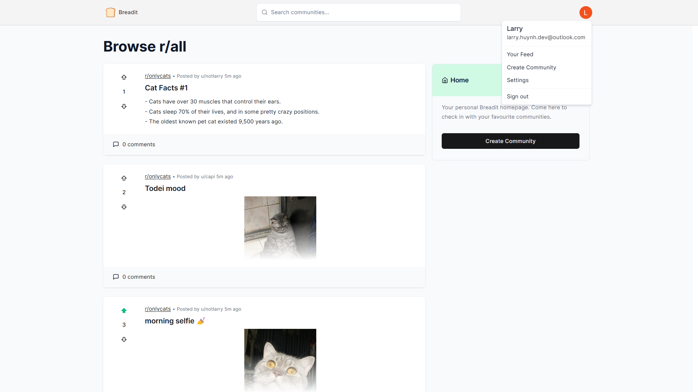
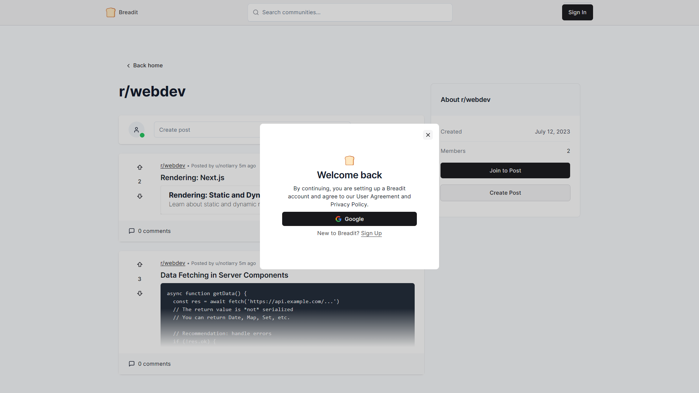
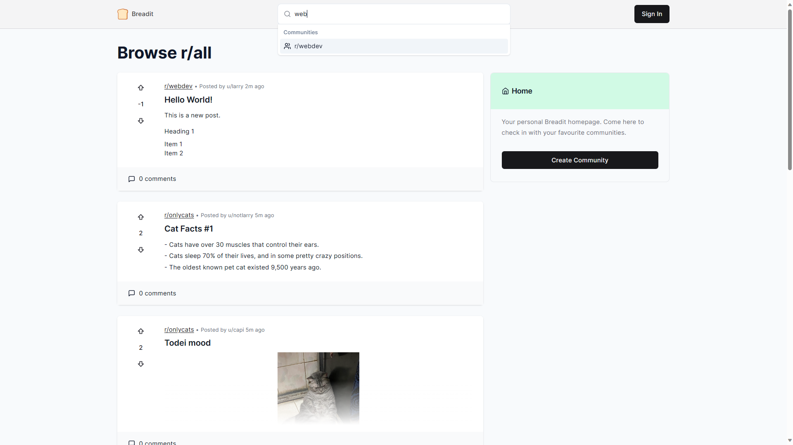
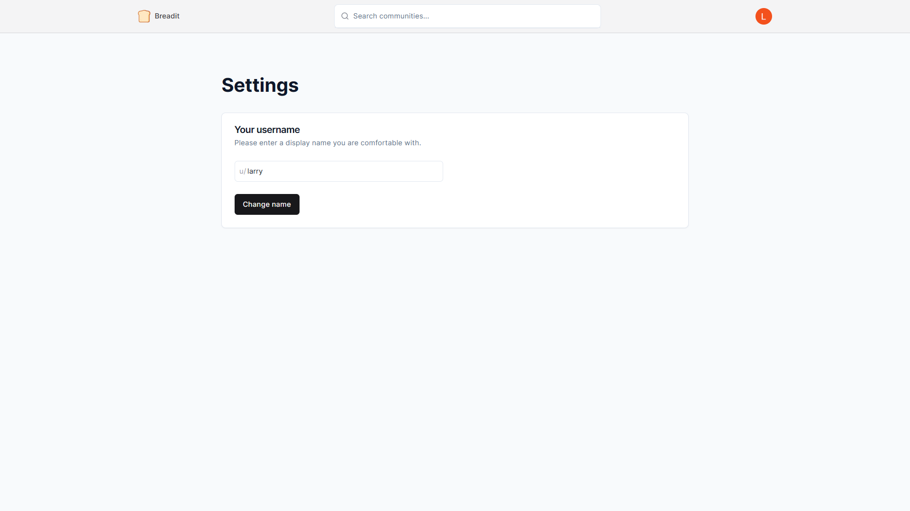
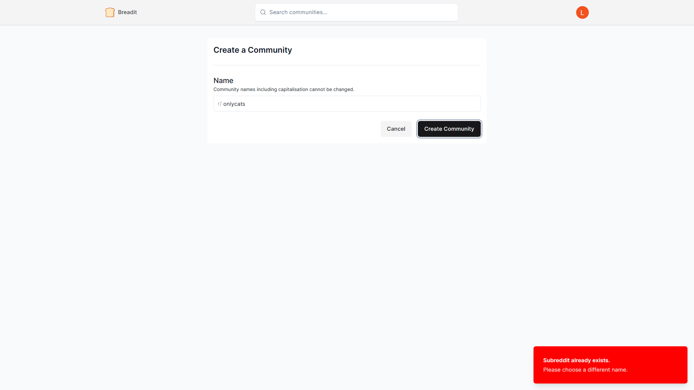
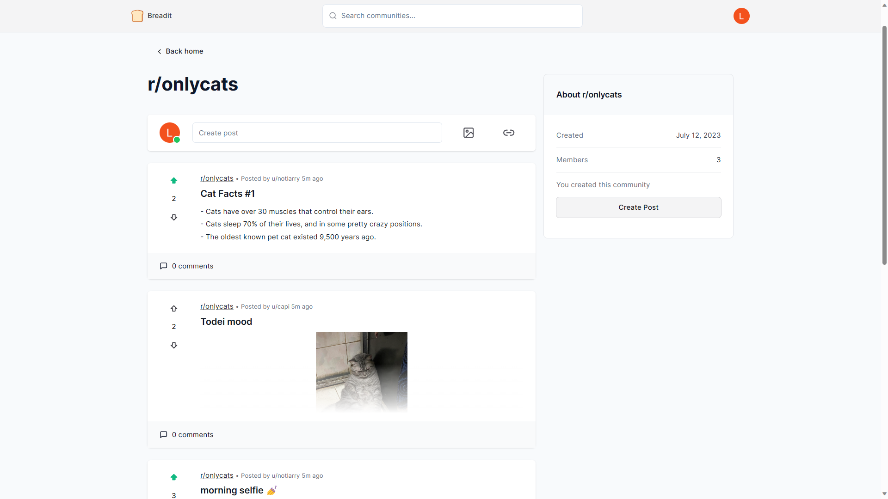
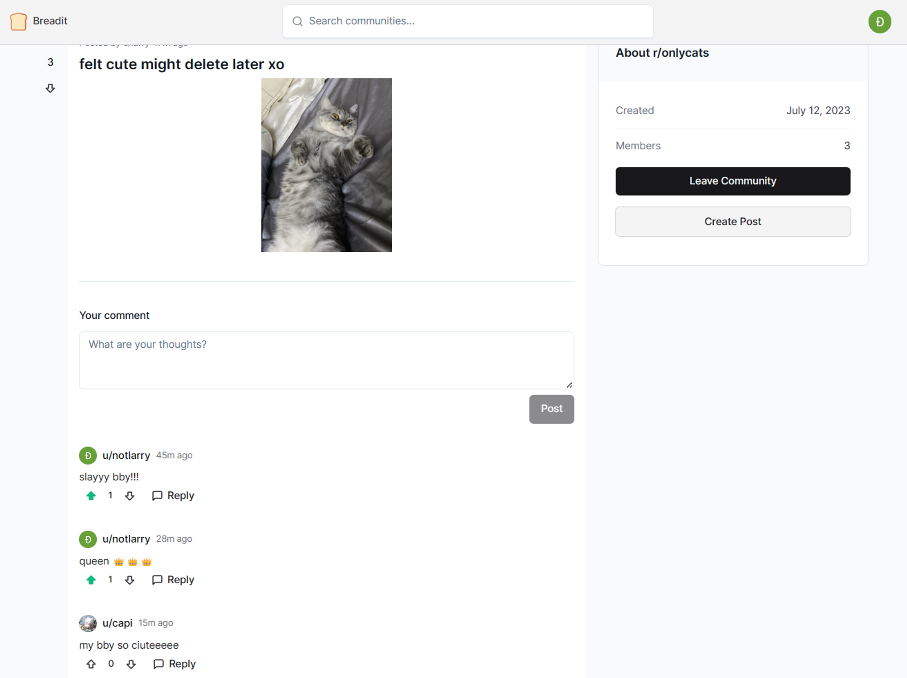
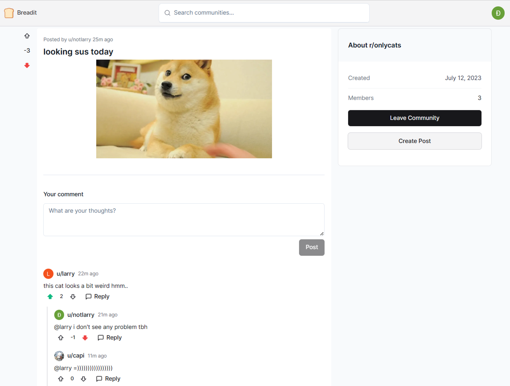

# Breadit

Modern full-stack Reddit clone.

## Features

- Full-stack serverless Next.js 13 application with App router and React Server Component.
- Authentication with NextAuth.js JWT and Google OAuth.
- MySQL Database with Prisma ORM and PlanetScale.
- Advanced data caching with Upstash Redis.
- Client-side data fetching and schema validation with React Query and Zod.
- Optimistic update, infinite query, data pagination, suspense streaming, middleware API protection, and many modern web features.
- Frontend UI crafted with Tailwind CSS, Radix Primitives, shadcn/ui.

## Previews

<figure>
  
  <figcaption align="center">Homepage</figcaption>
</figure>

<figure>
  
  <figcaption align="center">Login modal</figcaption>
</figure>

<figure>
  
  <figcaption align="center">Subreddit search</figcaption>
</figure>

<figure>
  
  <figcaption align="center">User settings</figcaption>
</figure>

<figure>
  
  <figcaption align="center">Subreddit creation</figcaption>
</figure>

<figure>
  
  <figcaption align="center">Subreddit feed</figcaption>
</figure>

<figure>
  
  <figcaption align="center">Post editor</figcaption>
</figure>

<figure>
  
  <figcaption align="center">Post page</figcaption>
</figure>

<figure>
  
  <figcaption align="center">Comment feed</figcaption>
</figure>
